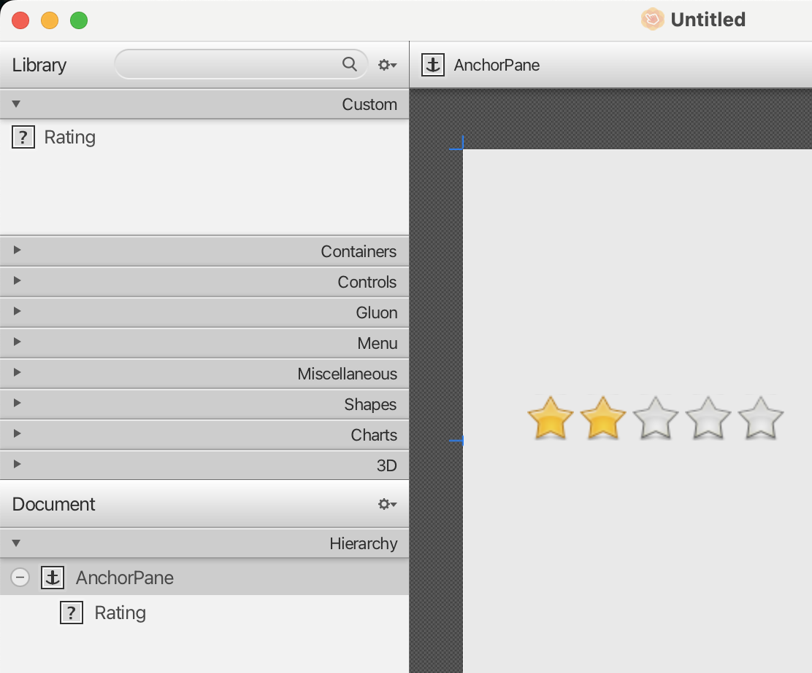
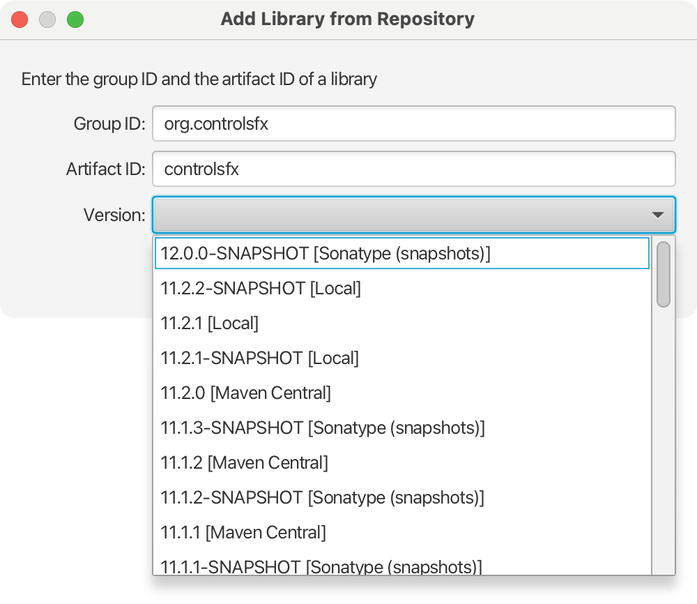

# The Library Manager

Scene Builder is designed to be used with a set of built-in controls, that can be selected from the Library panel (at the left)

<p align="center"></p>

However, many projects use extra sets of controls, which will be called from now on _custom controls_, that is, JavaFX controls that are not in the built-in set of default controls.

The Library Manager deals with custom controls in different ways, allowing the user not only to import local jar or FXML files, but also to import jars from a number of repositories, remote and local, public and even private ones.

On top of the Library pane item, there is a small MenuButton control with a cog icon, press it to show the Library Manager dialog:

<p align="center"></p>

### View as List or Sections options

The first two menu items are for selecting between using a flat list to list all the components in the Library (custom and built-in ones):

<p align="center"></p>

or the default Accordion container with TiledPanes as Sections, as shown earlier above.

### Import Selection option

This is a quick way of creating a custom control out of an existing FXML in Scene Builder.

<p align="center"></p>

Once you select part of it, clicking the menu item will create a custom control which in this case is a simple FXML file:

<p align="center"></p>

This FXML code snippet can be reused now in other FXMLs.

### Custom Library Folder option

The last menu item refers to the Section for Custom Controls:

<p align="center"></p>

There is a system folder where custom jars and files are cached, and this can be revealed in Finder. And for all existing custom controls, an analysis can be performed and the report will show possible errors. This is useful especially when importing a custom control doesn't behave as expected.

### JAR/FXML Manager option

The third menu item gives you access to the Library Manager dialog:

<p align="center"></p>

If there were already some custom controls (jars or FXML files)  presented in the Custom section of the Library, then those would be listed in this dialog.

For each library or file, the user can edit or delete it. Editing an FXML will open it in Scene Builder. Editing a jar file will open a dialog where the user can preview and select or unselect different components (if any) of that jar that will be added to the Custom panel.

On the lower part of the dialog, there are different actions that the user can perform.

### Search repositories option

The user can type a name of a library: full name or part of its group id, or full name or part of it of the artifact id, following the usual naming convention.

<p align="center"></p>

For instance, to download and install the latest release of ControlsFX, just by typing its maven group `org.controlsfx`, the existing artifacts (in the registered repositories) will show up:

<p align="center"></p>

Then selecting one of the presented results will download the latest release of the artifact from one of the repositories, install it to the user's local .m2, find all possible custom controls found in the jar, and present them for a preview:

<p align="center"></p>

The user can browse over the list of custom controls, select anyone for a preview (not all have one), and select one or more custom controls to be imported.

After pressing Import Components, the Import dialog will close and the Manager will show a new entry added:

<p align="center"></p>

And while the full jar was imported, only the selected custom controls are added into the Custom section, ready to be used:

<p align="center"></p>

If other controls are needed from this jar, the user can open the Library Manager again, and edit the related entry, to select again from the Import dialog.

Also note that if an artifact is removed from the list, it will just be removed from Scene Builder, but the artifact won’t be removed from the local .m2 repository.

### Manually add Library from repository option

The user can type the exact names of groupID and artifactID coordinates of an artifact to get all existing versions of an artifact in all registered repositories:

<p align="center"></p>

For instance, for `org.controlsfx` group and `controlsfx` artifact, a list is found in the registered repositories (Maven Central releases, Sonatype snapshots, Local .m2, Nexus, …):

<p align="center"></p>

Then any given version can be selected to extract its custom controls, as it was shown earlier.

### Add Library/FXML from file system option

This option opens a file chooser that lets the user find a jar or an FXML file in the local file system.

<p align="center"></p>

After locating and selecting a jar with one or more custom controls, it will extract them, in the same way:

<p align="center"></p>

### Add root folder with *.class files option

This is an alternative to adding the jar with the packaged classed: when building the control, the output folder that contains the list of classes is enough to find and import the custom control. The result is the same as with the jar, but this option removes the extra step of packaging, especially while developing the early versions of the control.

<p align="center"></p>

### Manage repositories option

Finally, the user can manage the repositories where artifacts are resolved from.

<p align="center"></p>

Initially, the preset list of remote repositories is listed. These are not editable and can’t be removed.

By clicking on Add Repository, the user can add new repositories to the list, both public or private.

A new repository requires a name and a valid URL. If it is private, the credentials are required as well. The test button will perform a connection to the given URL to check if it is valid or not, and if private, if the credentials are valid as well.

<p align="center"></p>

Note that in case of private repositories, the credentials will be stored locally in the user preferences. They will be used only when installing libraries from the private repository.

## The Custom section

All the components imported once from either local or remote repositories or from the local file system, will be listed in the Custom panel, ready to be used. These will remain available upon further restarts of Scene Builder, and will only be removed, if user does so from the Library Manager.

## Custom controls

To extract valid custom controls from the added jars or files, Scene Builder has to check every class or FXML file in the added jars/files and determine if those classes are valid custom controls or not.

To determine if a *.class file is a possible custom control candidate, the following rules are applied:

- First, it checks that the class name is not null, and the package name doesn't start with:
    ```
    {"java.”, "javax.", "javafx.", "com.oracle.javafx.scenebuilder.", "com.javafx.", "module-info", “com.gluonhq.charm.glisten”)}
    ```

- For valid class names, the classLoader tries to load the class
- The class should be public or protected and not abstract or package-private
- Finally, for the valid classes, FXMLLoader tries to load a simple FXML file that contains a reference to the given class. For instance, for the Popup custom control:
    ```
    <?xml version="1.0" encoding="UTF-8"?>
    <?import popup.Popup?>
    <Popup/>
    ```
- If the process succeeds, the class is considered a custom control.

After the control is imported, there could be still some errors (related to its properties, for instance), and for that the Jar Analyzer report can offer valuable insight.

### The Popup Custom Control

This is just an example of a very simple custom control.

The following classes define the Popup custom control that could be used as a simple bubble message node for chat applications.

<details>
<summary>Popup.java</summary>

```java
package popup;

import javafx.beans.NamedArg;
import javafx.css.converter.PaintConverter;
import java.util.ArrayList;
import java.util.Collections;
import java.util.List;
import javafx.beans.DefaultProperty;
import javafx.beans.property.ObjectProperty;
import javafx.beans.property.SimpleStringProperty;
import javafx.beans.property.StringProperty;
import javafx.beans.value.WritableValue;
import javafx.css.CssMetaData;
import javafx.css.FontCssMetaData;
import javafx.css.StyleOrigin;
import javafx.css.Styleable;
import javafx.css.StyleableObjectProperty;
import javafx.css.StyleableProperty;
import javafx.scene.control.Control;
import javafx.scene.control.Skin;
import javafx.scene.paint.Color;
import javafx.scene.paint.Paint;
import javafx.scene.text.Font;

@DefaultProperty("content")
public class Popup extends Control {
    
    public Popup(@NamedArg("message") String message) {
        getStyleClass().setAll("popup");
        
        setContent(message);  
    }
    
    private final StringProperty content = new SimpleStringProperty(this, "content", "Default Message");
    public final String getContent() { return content.get(); }
    public final void setContent(String value) { content.set(value); }
    public final StringProperty contentProperty() { return content; }

    @Override
    protected Skin<?> createDefaultSkin() {
        return new PopupSkin(this);
    }

    @Override
    public String getUserAgentStylesheet() {
        return Popup.class.getResource("popup.css").toExternalForm(); 
    }
        
    private ObjectProperty<Paint> bubbleFill;
    private ObjectProperty<Paint> textFill;
    private ObjectProperty<Font> textFont;
    
    public final Paint getTextFill() {
        return null == textFill ? Color.BLACK : textFill.get();
    }
    public final void setTextFill(Paint value) {
        textFillProperty().set(value);
    }
    public final ObjectProperty<Paint> textFillProperty() {
        if (null == textFill) {
            textFill = new StyleableObjectProperty<>(Color.BLACK) {

                @Override public CssMetaData<Popup, Paint> getCssMetaData() { return StyleableProperties.TEXT_FILL; }

                @Override public Object getBean() { return Popup.this; }

                @Override public String getName() { return "textFill"; }
            };
        }
        return textFill;
    }
    
    public final Paint getBubbleFill() {
        return null == bubbleFill ? Color.BLACK : bubbleFill.get();
    }
    
    public final void setBubbleFill(Paint value) {
        bubbleFillProperty().set(value);
    }
    
    public final ObjectProperty<Paint> bubbleFillProperty() {
        if (null == bubbleFill) {
            bubbleFill = new StyleableObjectProperty<>(Color.BLACK) {

                @Override public CssMetaData<Popup, Paint> getCssMetaData() { return StyleableProperties.BUBBLE_FILL; }

                @Override public Object getBean() { return Popup.this; }

                @Override public String getName() { return "bubbleFill"; }
            };
        }
        return bubbleFill;
    }
    
    public final Font getTextFont(){
        return null == textFont ? Font.getDefault() : textFont.get();
    }
    
    public final void setTextFont(Font value) {
        textFontProperty().set(value);
    }
    
    public final ObjectProperty<Font> textFontProperty() {
        if (null == textFont) {
            textFont = new StyleableObjectProperty<>(Font.getDefault()) {
                private boolean fontSetByCss = false;
                @Override public void applyStyle(StyleOrigin newOrigin, Font value) {
                    try {
                        fontSetByCss = true;
                        super.applyStyle(newOrigin, value);
                    } catch(Exception e) {
                        throw e;
                    } finally {
                        fontSetByCss = false;
                    }
                }
                @Override public void set(Font value) {
                    final Font oldValue = get();
                    if (value != null ? !value.equals(oldValue) : oldValue != null) {
                        super.set(value);
                    }
                }
                @Override protected void invalidated() {
                    if (!fontSetByCss) {
                        Popup.this.layout();
                        Popup.this.applyCss();
                        Popup.this.requestLayout();
                    }
                }
                @Override public CssMetaData<Popup, Font> getCssMetaData() { return StyleableProperties.TEXT_FONT; }
                @Override public Object getBean() { return Popup.this; }
                @Override public String getName() { return "textFont"; }
            };
        }
        return textFont;
    }
    
    private static class StyleableProperties {
        
        private static final CssMetaData<Popup, Paint> BUBBLE_FILL =
            new CssMetaData<>("-bubble-fill", PaintConverter.getInstance()) {

                @Override public boolean isSettable(Popup bubble) {
                    return null == bubble.bubbleFill || !bubble.bubbleFill.isBound();
                }

                @Override public StyleableProperty<Paint> getStyleableProperty(Popup popup) {
                    return  (StyleableProperty<Paint>)(WritableValue<Paint>) popup.bubbleFillProperty();
                }
            };
        
        private static final CssMetaData<Popup, Paint> TEXT_FILL =
            new CssMetaData<Popup, Paint>("-text-fill", PaintConverter.getInstance(), Color.BLACK) {

                @Override public boolean isSettable(Popup bubble) {
                    return null == bubble.textFill || !bubble.textFill.isBound();
                }

                @Override public StyleableProperty<Paint> getStyleableProperty(Popup popup) {
                    return (StyleableProperty<Paint>)(WritableValue<Paint>) popup.textFillProperty();
                }
            };
        
        private static final FontCssMetaData<Popup> TEXT_FONT =
            new FontCssMetaData<Popup>("-text-font", Font.getDefault()) {

                @Override public boolean isSettable(Popup bubble) {
                    return null == bubble.textFont || !bubble.textFont.isBound();
                }

                @Override public StyleableProperty<Font> getStyleableProperty(Popup bubble) {
                    return (StyleableProperty<Font>)(WritableValue<Font>)bubble.textFontProperty();
                }
            };
        
        private static final List<CssMetaData<? extends Styleable, ?>> STYLEABLES;
        static {
            final List<CssMetaData<? extends Styleable, ?>> styleables = 
                    new ArrayList<>(Control.getClassCssMetaData());
            styleables.add(BUBBLE_FILL);
            styleables.add(TEXT_FILL);
            styleables.add(TEXT_FONT);
          
            STYLEABLES = Collections.unmodifiableList(styleables);
        }
        
    }
    
    public static List<CssMetaData<? extends Styleable, ?>> getClassCssMetaData() {
        return StyleableProperties.STYLEABLES;
    }
    
    @Override
    public List<CssMetaData<? extends Styleable, ?>> getControlCssMetaData() {
        return getClassCssMetaData();
    }
    
}
```
</details>

<details>
<summary>PopupSkin.java</summary>

```java
package popup;

import javafx.beans.binding.Bindings;
import javafx.geometry.Insets;
import javafx.scene.control.SkinBase;
import javafx.scene.layout.Background;
import javafx.scene.layout.BackgroundFill;
import javafx.scene.layout.CornerRadii;
import javafx.scene.layout.Pane;
import javafx.scene.layout.Region;
import javafx.scene.text.Text;
import javafx.scene.text.TextAlignment;

public class PopupSkin extends SkinBase<Popup> {

    private final Pane pane = new Pane();
    private final Region region = new Region();
    private final Text text = new Text();
    
    private final Popup control;
    
    public PopupSkin(Popup control) {
        super(control);
        this.control = control;
        
        initialize();
    }

    private void initialize() {
        pane.getStyleClass().add("popup-pane");
        region.getStyleClass().add("popup-region");
        text.getStyleClass().add("popup-text");
        
        region.backgroundProperty().bind(Bindings.createObjectBinding(()->
                new Background(new BackgroundFill(getSkinnable().getBubbleFill(), CornerRadii.EMPTY, Insets.EMPTY)), 
                getSkinnable().bubbleFillProperty()));
        
        text.setTextAlignment(TextAlignment.CENTER);
        
        text.textProperty().bind(control.contentProperty());
        
        text.fillProperty().bind(control.textFillProperty());
        text.fontProperty().bind(getSkinnable().textFontProperty());
        
        pane.setPrefSize(50, 50);
        pane.getChildren().addAll(region, text);
        getChildren().add(pane);
    }

    @Override
    protected void layoutChildren(double contentX, double contentY, double contentWidth, double contentHeight) {
        super.layoutChildren(contentX, contentY, contentWidth, contentHeight); 
        
        pane.resize(contentWidth, contentHeight);
        
        region.setPrefSize(0.8 * contentWidth, 0.8 * contentHeight);
        region.relocate(0.1 * contentWidth, 0.1 * contentHeight);
        
        text.setWrappingWidth(contentWidth / 2d);
        
        text.relocate(pane.getWidth() / 2d - text.getBoundsInLocal().getWidth() / 2d, 
                      pane.getHeight() / 2d - text.getBoundsInLocal().getHeight() / 2d);
    }
}
```
</details>


<details>
<summary>popup.css</summary>

```css
.popup {

}

.popup > .popup-pane > .popup-region {
    /* https://commons.wikimedia.org/wiki/File:Speech_bubble.svg */
    -fx-shape: "M 45.673,0 C 67.781,0 85.703,12.475 85.703,27.862 C 85.703,43.249 67.781,55.724 45.673,55.724 C 38.742,55.724 32.224,54.497 26.539,52.34 C 15.319,56.564 0,64.542 0,64.542 C 0,64.542 9.989,58.887 14.107,52.021 C 15.159,50.266 15.775,48.426 16.128,46.659 C 9.618,41.704 5.643,35.106 5.643,27.862 C 5.643,12.475 23.565,0 45.673,0 M 45.673,2.22 C 24.824,2.22 7.862,13.723 7.862,27.863 C 7.862,34.129 11.275,40.177 17.472,44.893 L 18.576,45.734 L 18.305,47.094 C 17.86,49.324 17.088,51.366 16.011,53.163 C 15.67,53.73 15.294,54.29 14.891,54.837 C 18.516,53.191 22.312,51.561 25.757,50.264 L 26.542,49.968 L 27.327,50.266 C 32.911,52.385 39.255,53.505 45.673,53.505 C 66.522,53.505 83.484,42.002 83.484,27.862 C 83.484,13.722 66.522,2.22 45.673,2.22 L 45.673,2.22 z ";
    -fx-background-color: red;
}

```
</details>

As it can be seen in the source code, the control is a regular JavaFX control with some JavaFX properties and a custom skin.

There are some specific optional annotations intended for FXML:

- `@DefaultProperty`: Specifies a property to which child elements will be added or set when an explicit property is not given.
- `@NamedArg`: allows an FXMLLoader to instantiate a class that does not have a zero-argument constructor.

When the control is added to Scene Builder, the control’s properties are visible in the Inspector area (to the right), and the user can interact with them:

<p align="center"></p>

```xml
<?xml version="1.0" encoding="UTF-8"?>

<?import javafx.scene.layout.AnchorPane?>
<?import javafx.scene.text.Font?>
<?import popup.Popup?>

<AnchorPane maxHeight="-Infinity" maxWidth="-Infinity" minHeight="-Infinity" minWidth="-Infinity" prefHeight="400.0" prefWidth="600.0" xmlns="http://javafx.com/javafx/21.0.1" xmlns:fx="http://javafx.com/fxml/1">
   <children>
      <Popup bubbleFill="#19ee2b" content="This is a message!" layoutX="351.0" layoutY="4.0" prefHeight="219.0" prefWidth="211.0" textFill="#dd0f0f">
         <textFont>
            <Font name="Bradley Hand Bold" size="25.0" />
         </textFont>
      </Popup>
   </children>
</AnchorPane>
```

## Troubleshooting

After importing a jar with one or more possible custom controls, it is possible that not all the expected controls show up. 

The Jar Analysis Report can provide insightful information about the reasons for this. As mentioned earlier, when exploring the jar, the FXMLLoader is instantiated with the possible custom control classes, and if something fails, the result is one or more exceptions that are captured by the Jar Analysis and the report just shows them:

<p align="center"></p>

By checking the exceptions, developers can go back and fix the issues in the source code.
